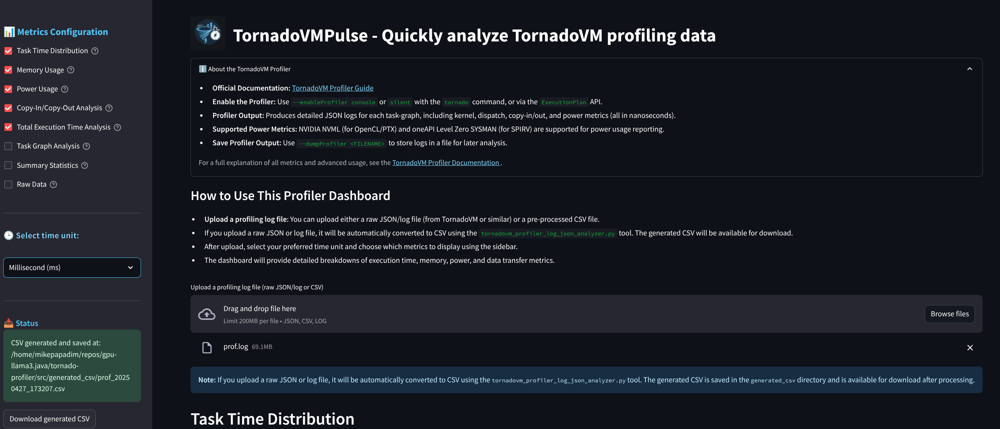
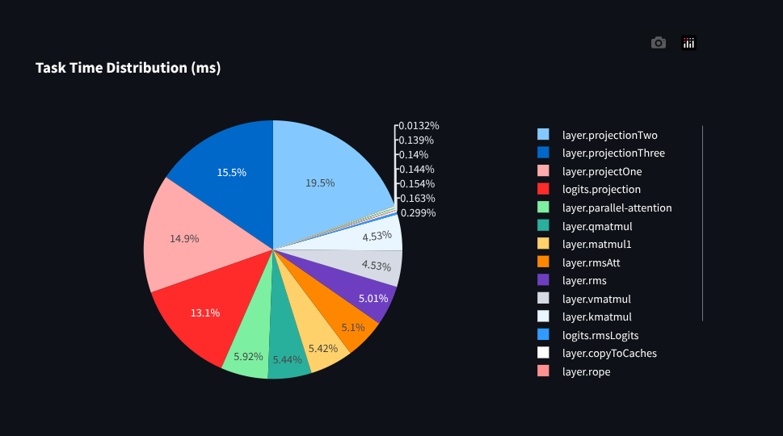
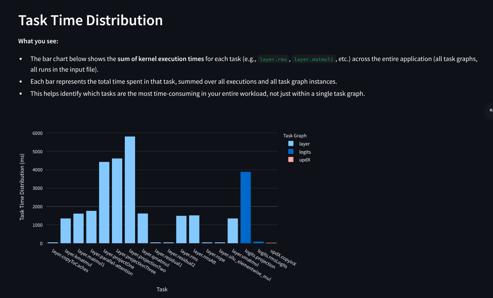
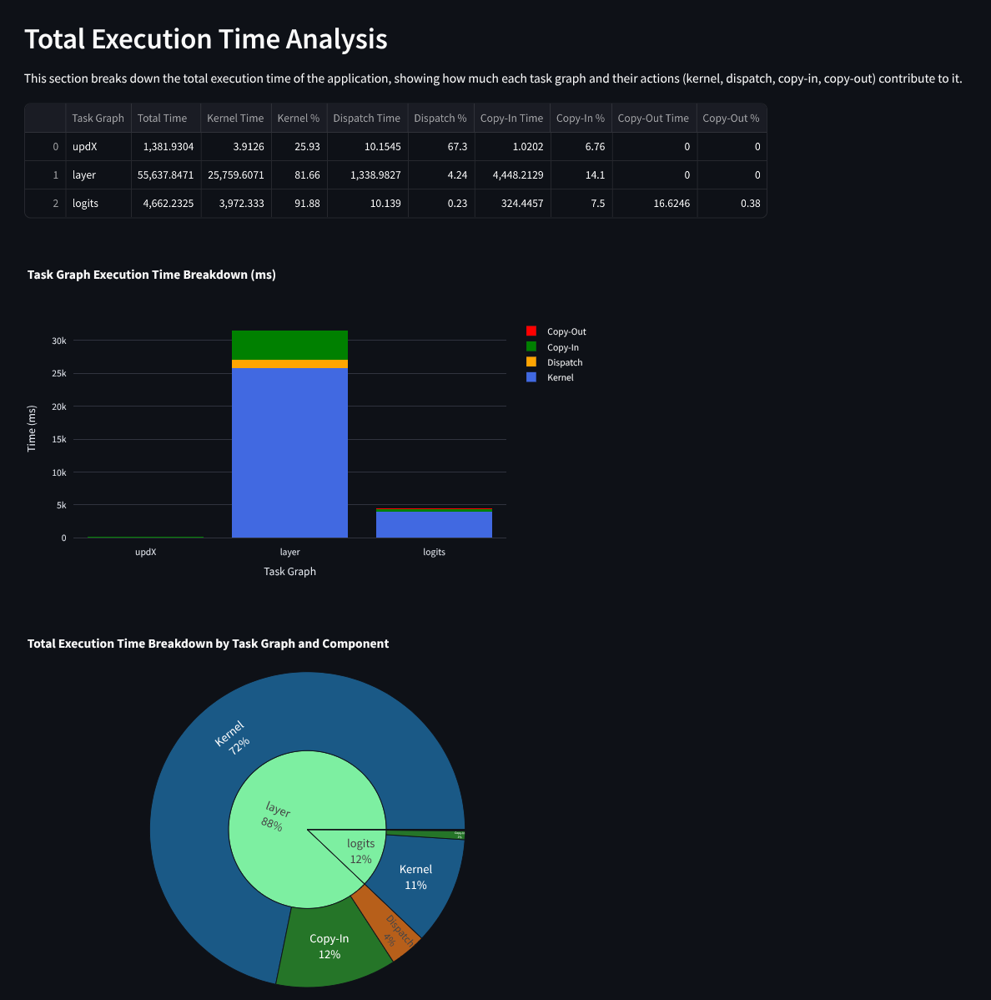

<h1 align="left">
  
 TornadoVMPulse
</h1>
TornadoVMPulse is an interactive web dashboard for visualizing and analyzing profiling data from <a href="https://tornadovm.readthedocs.io/en/latest/profiler.html">TornadoVM</a>. It provides deep insights into kernel execution, data transfer, memory, and power usage, with a modern, user-friendly interface.
<br>
<br>    

<p align="center">
  
</p>

---

## Features

- **Upload and Analyze Logs:** Supports TornadoVM profiler logs in JSON, log, or CSV format.
- **Automatic Conversion:** Raw logs are automatically converted to CSV for analysis.
- **Interactive Visualizations:**
  - Task Time Distribution (color-coded by task graph)
  - Memory Usage
  - Power Usage
  - Copy-In/Copy-Out Analysis
  - Total Execution Time Analysis (table, stacked bar, and sunburst chart)
  - Task Graph Analysis (per-task breakdown for a selected task graph)
- **Sidebar Configuration:** Select which metrics to display and the time unit (ns, ms, sec).
- **Downloadable Results:** Download generated CSVs after processing.
- **Modern UI:** Custom logo, collapsible info panels, and beautiful charts.

---

## Usage

1. **Install dependencies:**
   ```bash
   pip install -r requirements.txt
   ```

2. **Run the dashboard:**
   ```bash
   streamlit run src/app.py
   ```

3. **Upload a profiling log file:**
   - Drag and drop a raw JSON/log or CSV file into the uploader.
   - If a raw file is uploaded, it will be converted to CSV and available for download.

4. **Explore the dashboard:**
   - Use the sidebar to select which metrics to display and the time unit.
   - Review the visualizations and download the generated CSV if needed.

---

## Visualizations & Metrics

### Task Time Distribution

- Bar chart showing the sum of kernel execution times for each task, color-coded by task graph.
- Pie chart for overall distribution.

**Example: Task Time Distribution as a Pie Chart (proportion of total kernel time per task):**


**Example: Task Time Distribution as a Bar Chart (kernel time per task, color-coded by task graph):**


### Memory Usage
- Bar chart of total and average memory usage (copy-in bytes) for each task graph.

### Power Usage
- Bar chart of average power usage for each task graph.

### Copy-In/Copy-Out Analysis
- Table and bar chart showing time and number of data transfer operations, and their contribution to total execution time.

### Total Execution Time Analysis

- Table breaking down total execution time by task graph and action (kernel, dispatch, copy-in, copy-out), with percentages.
- Stacked bar chart for visual comparison.
- **Sunburst chart:** Hierarchical breakdown of total execution time by task graph and component, with interactive tooltips.

**Example Table, Stacked Bar, and Sunburst Chart:**


### Task Graph Analysis
- Dropdown to select a specific task graph.
- Stacked bar chart showing how time is spent (kernel, copy-in, copy-out, dispatch) for each task in the selected graph.
- Memory usage per task (if available).

### Summary Statistics
- Statistical summary of the selected metrics.

### Raw Data
- View the raw input data as a DataFrame.

---

## Sidebar Controls

- **Metrics Configuration:** Select which visualizations to display.
- **Select time unit:** Choose between nanoseconds, milliseconds, or seconds.
- **Status:** See CSV generation status and download the generated CSV.

---

## About the TornadoVM Profiler

- [Official Documentation](https://tornadovm.readthedocs.io/en/latest/profiler.html)
- Enable the profiler with `--enableProfiler console` or `silent` or via the `ExecutionPlan` API.
- Profiler output includes kernel, dispatch, copy-in/out, and power metrics.
- Supported power metrics: NVIDIA NVML (OpenCL/PTX) and oneAPI Level Zero SYSMAN (SPIRV).
- Save profiler output with `--dumpProfiler <FILENAME>`.

---

## Customization

- The dashboard uses a custom logo (`static/pulse-logo.png`).
- You can further customize the UI and add new visualizations as needed.

---

## License

MIT License

---
